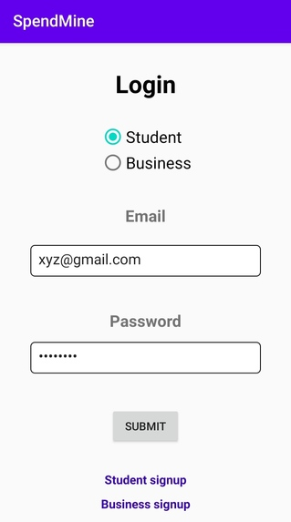
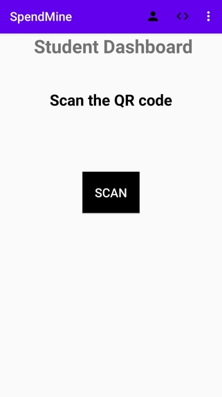
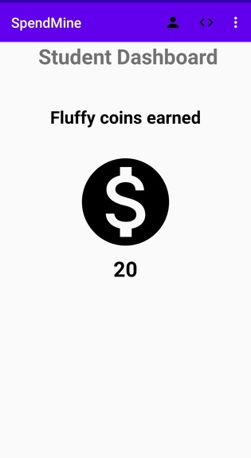
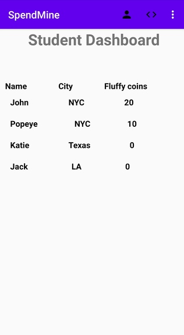
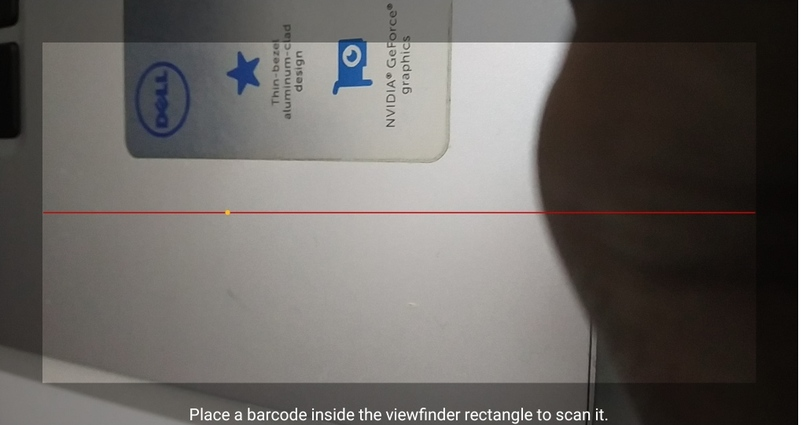

# SpendMine
<b>Android application built during the "Hex Cambridge" hackathon.</b>  

# About Hex Cambridge hackathon:
Hex Cambridge is Cambridge's biggest 36 hour hackathon where some of the best hackers from all over the world are selected to participate

# Features of the application:
- The android application takes in the details of the student and his expenditure and checks whether he is spending wisely.  
- If he does, he is given 'fluffy' coins.  
- There is a leaderboard to see how they compare with other students.  
- They can redeem the fluffy coins in entertainment places who are tied up with us like a cinema halls, opera etc.  
- If they spend lesser than the estimated amount for entertainment, they get more fluffy coins. 

  
# Probable future of SpendMine:
- Spend Mine would display graphs of the expenditures of the students and tie up with online payment applications like Paypal in order to directly track the amount spent by a student.  
- We would also provide personalised recommendations to the users as to which entertainment location is suitable for them according to their budget/expenditure.

  
# Wireframes:
     
    

         

